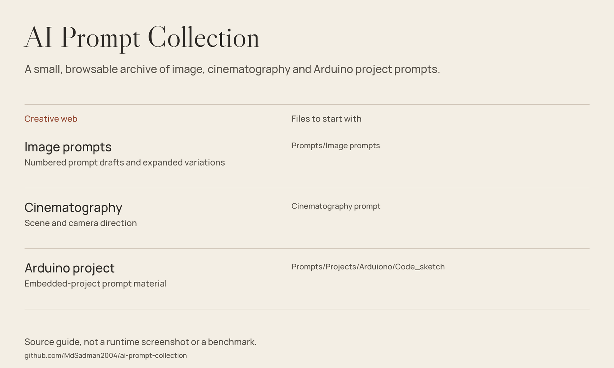

# AI Prompt Collection

A small, browsable archive of image, cinematography and Arduino project prompts.



*Source guide drawn from the files in this repository; not a runtime screenshot or a fresh benchmark.*

[Getting started](#getting-started) · [Source guide](#source-guide) · [Scope & limitations](#scope--limitations)

## Browse the collection

| Collection | What to read |
| :-- | :-- |
| Image studies | [Image prompt drafts](Prompts/Image%20prompts): numbered variants and expanded versions. |
| Scene direction | [Cinematography prompt](Cinematography%20prompt). |
| Anime landscapes | [Landscape prompt](Highly%20detailed%20anime%20style%20landscape%20prompt). |
| Arduino | [Project prompt](Prompts/Projects/Arduiono/Code_sketch). |

## Getting started

Clone the repository and open any prompt in a text editor. Copy only the parts relevant to your tool, replace subject and composition details, and keep your own record of the model and settings used.

```bash
git clone https://github.com/MdSadman2004/ai-prompt-collection.git
cd ai-prompt-collection
```

There is no installation step or executable prompt runner. Paths keep their original spelling, including `Arduiono`.

## Source guide

| Component | File | Purpose |
| :-- | :-- | :-- |
| Image prompts | [Prompts/Image prompts](Prompts/Image%20prompts) | Numbered prompt drafts and expanded variations |
| Cinematography | [Cinematography prompt](Cinematography%20prompt) | Scene and camera direction |
| Arduino project | [Prompts/Projects/Arduiono/Code_sketch](Prompts/Projects/Arduiono/Code_sketch) | Embedded-project prompt material |

## Scope & limitations

These are authored prompt texts, not generated-image samples or a reproducible model benchmark. Results depend on the external model, settings and interpretation. No model weights or inference service are included.

## Reuse & attribution

No standalone repository-wide license file is included in this checkout. Public source access is not a blanket license grant; check provenance and permissions before redistribution.
